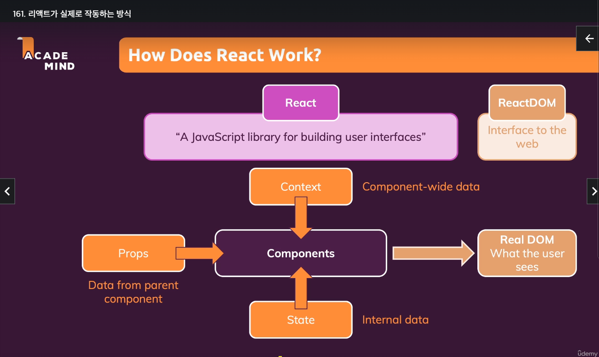
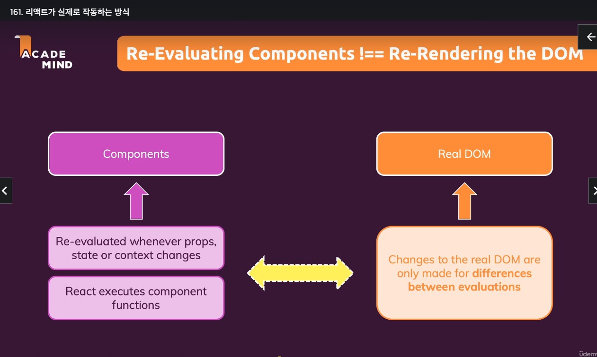
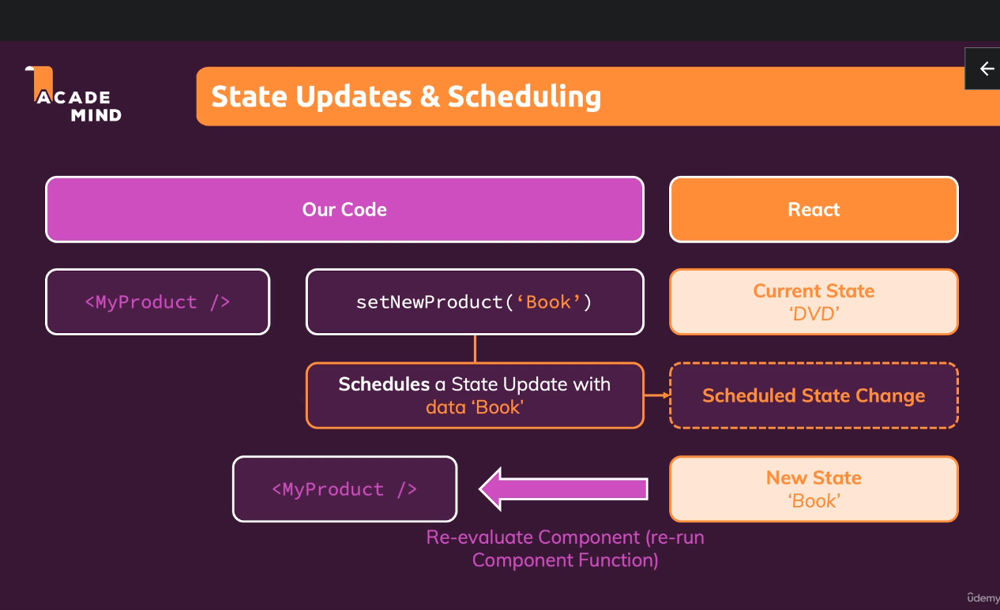

- 부모 컴포넌트가 재실행되면 아래의 자식 컴포넌트들도 변화가 없어도
  재실행된다

```js
export default React.memo(Demo);
```

- 특정상황에만 컴포넌트가 재실행되도록 할 수 있다
- props가 변경된 경우에만 재실행 및 재평가
- 클래스 컴포넌트에선 실행되지 않는다
- 성능에 대한 비용이 필요하므로 꼭 최적화에 좋다고 할 수 없다
- 함수에 대한 재평가엔 의미가 없다..

### useCallback

- 사용하려는 함수를 감싸 재평가를 해야하는 지 확인한다

```js
useCallback(() => {}, [종속성(의존성)]);

const [show, setShow] = useState(false);
const toggleHanlder = useCallback(() => {
  setShow((prevShow) => !prevShow);
}, []);
```


## state 스케쥴링 및 일괄처리 이해하기
`state`변경을 입력하면 리액트는 이를 예약해놓고 사용자의 입력 등 우선순위를 먼저 실행하고
변경한다 이를 위해 `state`를 변경할 때는 바로 하는 것이 아니라
한 단계를 거치고(함수를 사용) 변경된 `state`를 사용해야 한다




### useMemo()
모든 종류의 데이터를 저장할 수 있다
- 정렬을 사용하는 경우 적합하다
```js
useMemo(() => {
  return // 저장하고자 하는 것을 반환
}, [의존성]);
```