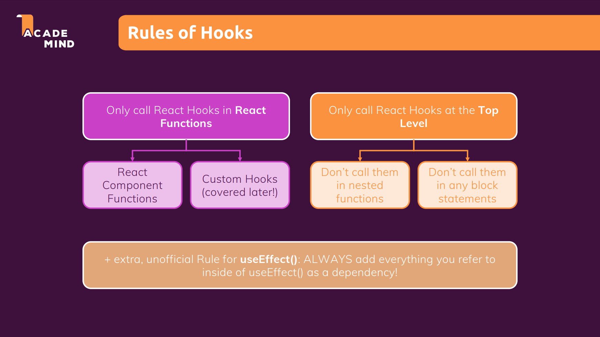

# context API

프롭(prop)을 통해 많은 컴포넌트를 거쳐 많은 데이터를 전달할 때 문제가 생길 수 있다
따라서, 한 곳에서 state를 관리할 수 있게 해주는 것

- 대부분 context는 객체로 생성한다
- context의 결과로 컴포넌트는 컴포넌트를 포함하는 객체가 된다

`Provider`: 하위의 모든 prop를 저장하고자 한다면 사용
`Consumer`:`Provider`에 저장한 prop을 사용하려면 `Consumer`로 감싼다

📌 대부분의 경우 `prop`을 사용하여 컴포넌트에 데이터를 전달한다
`prop`은 컴포넌트를 구성하고 그것들을 재사용할 수 있도록 하기 때문이다

## useContext 훅

```js
const ctx = useContext(AuthContext);
```

`props` 대신 `ctx`를 참조하며 `ctx`에 `AuthContext` 컴포넌트 안의 값을 넣는다
컨텍스트를 사용하게 되면 이 외의 동작은 할 수 없으므로 다양한 동작이 필요한 경우엔 `props`를 이용한다

## 컨텍스트를 동적으로 만드는 법

## 리액트 컨텍스트 제한

자주 변경되는 경우 적합하지 않다
=> 매초 또는 1초에 여러번 변경되는 경우같이 자주 바뀐다면 적합하지 X

## 훅의 규칙



- `use`로 시작하는 함수
- 리액트 컴포넌트 함수 혹은 사용자 정의 훅 안에서만 사용해야 한다
- 리액트 컴포넌트 함수 또는 사용자 정의 훅 함수의 최상위 수준에서 호출해야한다
=> ❗중첩 함수, 블럭 함수에서 훅을 호출하지 말 것!
-`useEffect()`는 참조하는 모든 항목을 의존성으로 추가한다
`useState()`의 경우는 변하지 않음을 리액트가 보장하므로 의존성에 추가하지 않아도 된다 
ex) `setFormIsValid`
