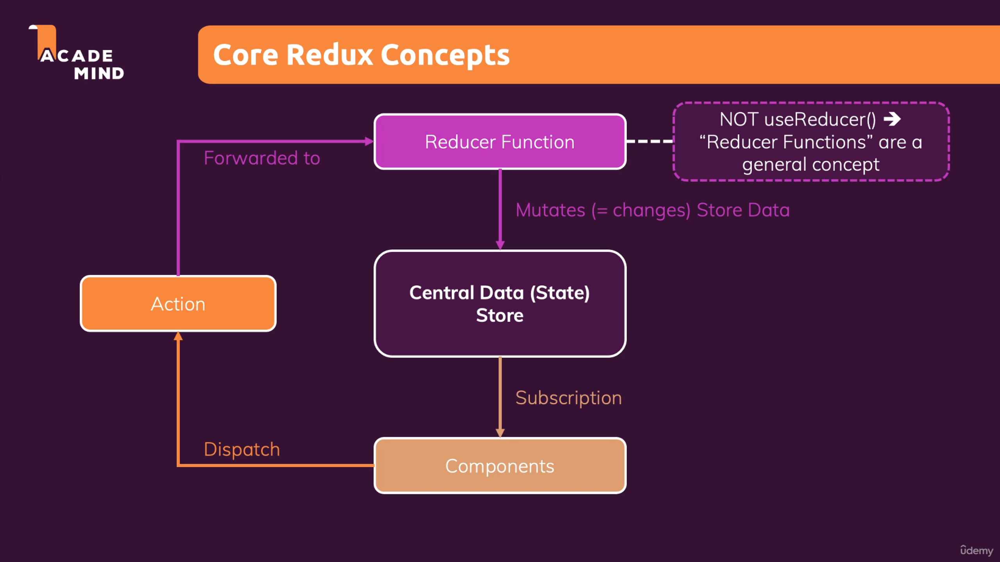

# Redux

`React-context`는 중첩이 될 수 있고 이로 인해 관리가 복잡해진다
또한, 데이터가 자주 변경되는 경우 성능이 좋지 않다
=> 유동정인 상태 확산에 좋지 않다

## 작동방식
- 하나의 중앙 데이터 관리소
- 구독한 컴포넌트의 데이터가 변경될 때 마다 저장소가 컴포넌트에게 알려준다
- 데이터 조작은 컴포넌트로 하는 것이 아니다 대신에 `Reducer` 함수를 사용한다
- `Reducer` 함수는 `useReducer`와는 다른 함수이다
- `Reducer` 함수는 입력을 변환해서 새로운 하나의 출력을 만들어낸다

## 핵심
- `Reducer` 함수는 순수함수가 되어야 한다
- 입력은 기존의 `state`와 `dispatch action`(발송된 액션: state 변경이 이루어질 수 있게 하는 것)
- 항상 새로운 객체를 리턴해야 한다

